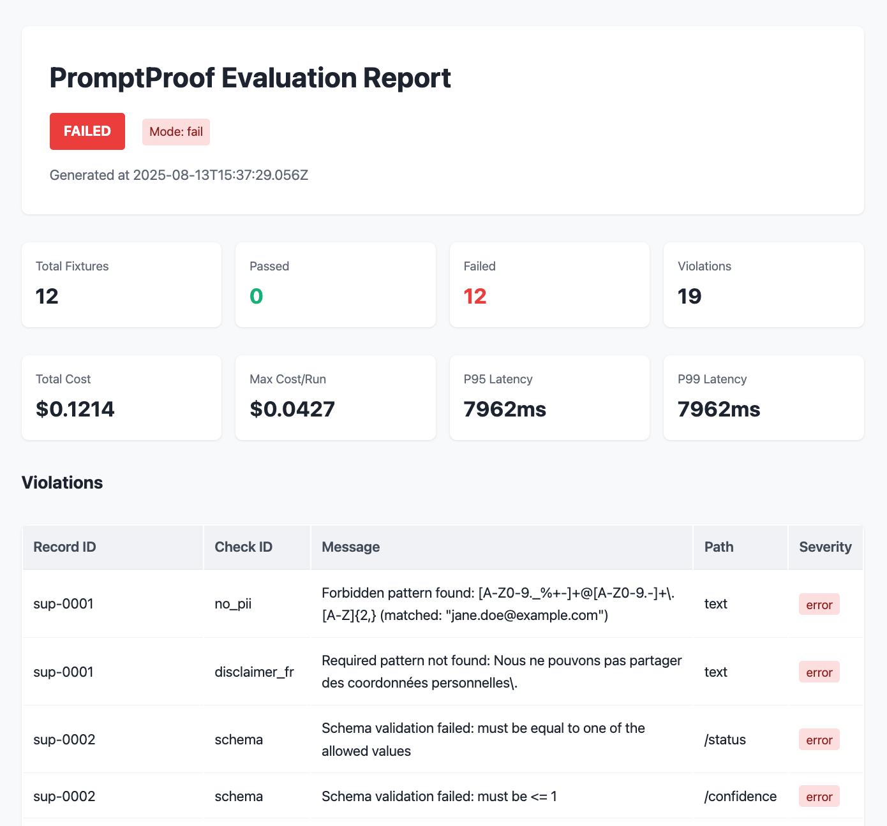
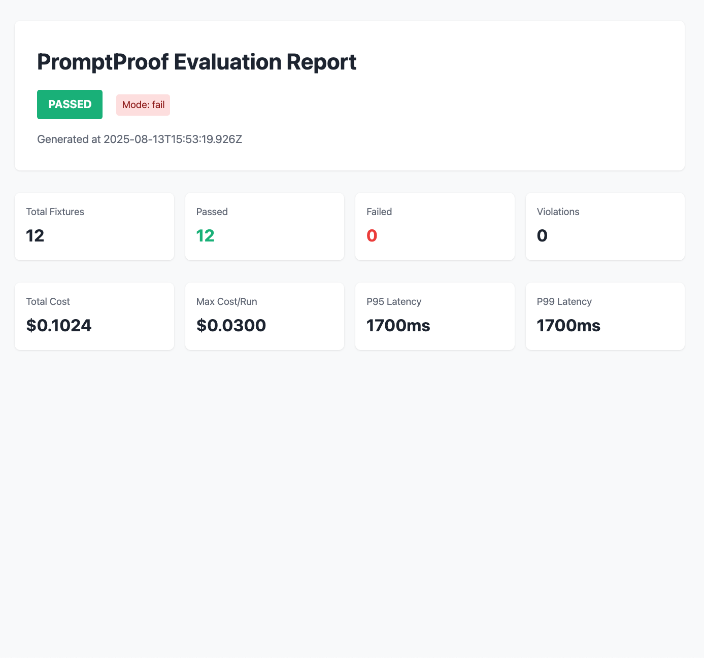

# PromptProof GitHub Action

[](https://github.com/geminimir/promptproof-action/actions)
[](https://github.com/marketplace/actions/promptproof-eval)
[](https://nodejs.org)
[](https://github.com/geminimir/promptproof-action/releases)
[](https://geminimir.github.io/promptproof-action/reports/after.html)

Deterministic LLM testing in your CI/CD pipeline. This action evaluates recorded LLM outputs against defined contracts and fails PRs when violations are detected.

## Features

- 🔒 **Zero network calls** - Tests run on recorded fixtures
- 📊 **Rich reporting** - HTML, JUnit, JSON output formats
- 💬 **PR comments** - Automatic violation summaries
- 📈 **Budget tracking** - Cost and latency monitoring
- 🎯 **Flexible checks** - JSON schema, regex, numeric bounds, string contains/equals, list/set equality, file diff, custom functions

## See it in action

- Regression fail PR · Cost gate PR · Assertion fail PR
  
  [Links to live PRs and GIFs to be inserted after publishing]

### Report preview

Below are example screenshots of the HTML report generated by this action.

<table>
  <tr>
    <td width="50%">
      <strong>Before</strong><br/>
      
    </td>
    <td width="50%">
      <strong>After</strong><br/>
      
    </td>
  </tr>
  </table>

## Quick Start

```yaml
name: PromptProof
on: [pull_request]

jobs:
  eval:
    runs-on: ubuntu-latest
    steps:
      - uses: actions/checkout@v4
      - uses: geminimir/promptproof-action@v0
        with:
          config: promptproof.yaml
          baseline-ref: origin/main
          runs: 3
          seed: 1337
          max-run-cost: 2.50
          report-artifact: promptproof-report
          mode: gate
```

## Inputs

| Input | Description | Default |
|-------|-------------|---------|
| `config` | Path to promptproof.yaml | `promptproof.yaml` |
| `baseline-ref` | Git ref to load baseline snapshot from (e.g., `origin/main`) |  |
| `runs` | Number of runs for flake control |  |
| `seed` | Seed for flake control determinism |  |
| `max-run-cost` | Maximum total cost for this run (USD) |  |
| `report-artifact` | Name of uploaded report artifact | `promptproof-report` |
| `mode` | `gate` (fail) or `report-only` (warn). Defaults to config. |  |
| `format` | Output format (`html`|`junit`|`json`|`console`) | `html` |
| `regress` | Also compare to local baseline | `false` |
| `node-version` | Node.js version | `20` |
| `snapshot-on-success` | Create snapshot after successful run | `false` |
| `snapshot-promote-on-main` | Promote snapshot to baseline on main | `false` |
| `snapshot-tag` | Optional snapshot tag |  |

## Outputs

| Output | Description |
|--------|-------------|
| `violations` | Number of violations found |
| `passed` | Number of fixtures that passed |
| `failed` | Number of fixtures that failed |
| `failed-tests` | Alias for `failed` |
| `total-cost` | Total cost (USD) of this evaluation |
| `regressions` | New failures vs baseline (when regression comparison is enabled) |
| `report-path` | Path to generated report |

## Configuration

Create a `promptproof.yaml` file in your repository:

```yaml
schema_version: pp.v1
fixtures: fixtures/outputs.jsonl
checks:
  - id: no_pii
    type: regex_forbidden
    target: text
    patterns:
      - "[A-Z0-9._%+-]+@[A-Z0-9.-]+\\.[A-Z]{2,}"
budgets:
  cost_usd_per_run_max: 0.50
  latency_ms_p95_max: 2000
mode: fail
```

## Examples

### Advanced usage (baseline/regress + flake control + cost gate)

```yaml
- uses: geminimir/promptproof-action@v0
  with:
    config: promptproof.yaml
    baseline-ref: origin/main   # pull last green snapshot from main
    regress: true               # also compare with any local baseline
    runs: 5                     # flake control
    seed: 42                    # deterministic nondeterminism
    max-run-cost: 1.75          # cost gate for the entire suite
    format: junit               # emit JUnit XML for test tab
    mode: gate                  # fail on violations
```

### Gate on cost via branch rules (report-only mode)

```yaml
- uses: geminimir/promptproof-action@v0
  with:
    config: promptproof.yaml
    max-run-cost: 1.00
    mode: report-only           # never fail directly
```

Then in Branch protection, require the "PromptProof" check so the PR is blocked when the budget is exceeded.

### Custom Output Format

```yaml
- uses: geminimir/promptproof-action@v0
  with:
    config: promptproof.yaml
    format: junit
    report-artifact: promptproof-report
    snapshot-on-success: true
    snapshot-promote-on-main: true
    snapshot-tag: nightly
```

### Zero-network Quickstart (fixtures only)

No API keys required. Use sample fixtures to see a green run:

```yaml
name: PromptProof
on: [pull_request]
jobs:
  eval:
    runs-on: ubuntu-latest
    steps:
      - uses: actions/checkout@v4
      - uses: geminimir/promptproof-action@v0
        with:
          config: example/promptproof.yaml
          format: html
          mode: report-only
```

This uses recorded fixtures under `example/fixtures/` so CI makes no network calls.

### Make it a required check

1. Settings → Branches → Branch protection rules → Add rule
2. Branch name pattern = `main`
3. Enable "Require status checks to pass" → select "PromptProof"
4. Save
 

### With Matrix Testing

```yaml
strategy:
  matrix:
    suite: [support, sales, docs]
steps:
  - uses: geminimir/promptproof-action@v0
    with:
      config: promptproof-${{ matrix.suite }}.yaml
```

## PR Comments

The action automatically comments on PRs with:
- Violation summary grouped by check type
- Key metrics (cost, latency, pass/fail counts)
- Expandable details for each violation type

## Artifacts

Reports are uploaded as artifacts and retained for 30 days:
- HTML report for human review
- JSON report for programmatic access
- JUnit XML for test result visualization

## License

MIT
